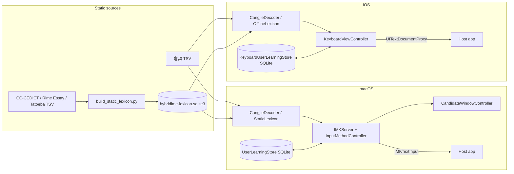

# HybridIME 技術文件

本文件描述目前 working tree 的實際 source、Xcode 設定與資料資產。它不以舊 release、檔名推測或先前實機結果代替本次證據。

狀態用語：

- **Implemented**：source 已存在並接入正常執行路徑。
- **Test-covered**：repository 有相應 test harness，但不表示本次已執行。
- **Verified in this task**：本次文件工作確實執行並成功的 validation。
- **Externally unverified**：需要安裝、真實 text client、Simulator／device、憑證或外部系統才能確認。
- **Experimental / Inactive**：存在但目前不能作正常保證路徑。
- **Planned / Not implemented**：只有合理擴充點，尚未實作。

## 1. System Overview

HybridIME 在一個 Xcode project 中提供兩套平台 adapter：

- macOS `HybridIME`：classic InputMethodKit application，`IMKInputController` 接收事件並用 `IMKTextInput` 更新 host。
- iOS／iPadOS `HybridIMEKeyboard`：`UIInputViewController` keyboard extension，以 `UITextDocumentProxy` 插入、刪除與移動游標；由 SwiftUI host app `HybridIMEiOS` 嵌入。

兩平台各有自己的 controller、dictionary wrapper、association logic 與 learning store，沒有獨立的共享 Swift module。它們共用 checked-in 倉頡 TSV 和同一份生成後的 SQLite lexicon 資產，但 source 有重複實作。

正常 runtime 完全離線：

1. 載入 bundled 倉頡 TSV。
2. 以 bundled read-only SQLite 查詢雙語與聯想資料。
3. 由平台 controller 管理 composition state、候選及 host text replacement。
4. 把使用者選擇寫入 target container 的本機 SQLite learning database。

沒有 runtime backend、HTTP provider、登入、APNs、iCloud、Keychain 或 telemetry path。

## 2. Architecture



### Dependency direction

- Platform controllers own lifecycle and composition state.
- Decoder／lexicon／association／ranker do not call UI code.
- Candidate UI consumes controller-produced presentation data.
- Learning stores own SQLite schema and persistence; callers receive empty results when the store is unavailable.
- Build scripts consume source data and produce checked-in runtime assets; runtime never reads raw CC-CEDICT／association TSV.

There is no dependency-injection framework. macOS `InputResources` and iOS controller properties act as composition roots. Production uses shared singleton learning stores; initializers accepting a database URL support standalone tests.

## 3. Project Structure

| Path | Responsibility |
| --- | --- |
| `HybridIME/HybridIMEApp.swift` | macOS `NSApplication` entry, `IMKServer`, shared resource preload |
| `HybridIME/InputMethodController.swift` | macOS event state machine, candidates, commit, punctuation and associations |
| `HybridIME/CandidateWindowController.swift` | Non-activating macOS candidate panel and caret positioning |
| `HybridIME/CangjieDecoder.swift` | macOS Cangjie TSV parser and glyph filter |
| `HybridIME/StaticLexicon.swift` | macOS read-only SQLite bilingual／association lookup |
| `HybridIME/BilingualDictionary.swift` | macOS domain wrapper around bilingual lexicon queries |
| `HybridIME/AssociationDictionary.swift` | macOS static and learned association merge／ranking |
| `HybridIME/SmartCandidateRanker.swift` | macOS most-recent smart candidate selection |
| `HybridIME/UserLearningStore.swift` | macOS writable SQLite learning schema |
| `HybridIMEKeyboard/KeyboardViewController.swift` | iOS keyboard UI, text proxy operations and composition state |
| `HybridIMEKeyboard/OfflineLexicon.swift` | iOS read-only SQLite lookup with bounded cache |
| `HybridIMEKeyboard/KeyboardAssociationDictionary.swift` | iOS association merge／ranking |
| `HybridIMEKeyboard/KeyboardUserLearningStore.swift` | iOS writable SQLite learning schema |
| `HybridIMEKeyboard/PunctuationStrategy.swift` | iOS punctuation definitions, context and display labels |
| `HybridIMEKeyboard/PrivacyInfo.xcprivacy` | Keyboard extension privacy manifest: no tracking／collected data and SystemBootTime reason `35F9.1` |
| `HybridIMEiOS/ContentView.swift` | Host app setup、離線本機學習與第三方鍵盤系統限制說明 |
| `HybridIME/CangjieData/` | Runtime Cangjie table, upstream snapshots, change log and notices |
| `HybridIME/DictionaryData/` | CC-CEDICT source index、overrides、license and notice used to generate SQLite |
| `HybridIME/AssociationData/` | Chinese／English association source indexes、licenses and notices |
| `HybridIMEKeyboard/CangjieData/` | iOS runtime Cangjie table and Rime Cangjie license／notice |
| `HybridIMEKeyboard/LexiconData/` | Bundled SQLite lexicon and copied notices for the keyboard extension |
| `Scripts/` | Dataset builders, validators, standalone tests and release tooling |

The project uses Xcode filesystem-synchronized groups. The macOS target explicitly excludes raw dictionary／association TSV resources and explicitly includes `HybridIMEKeyboard/LexiconData/hybridime-lexicon.sqlite3`; both platform targets therefore use the same generated lexicon file in the repository.

## 4. Data Flow

### Static data generation

`Scripts/build_cedict_index.swift`, `Scripts/build_chinese_associations.swift` and `Scripts/build_english_associations.swift` generate source TSV indexes. `Scripts/build_static_lexicon.py` then:

1. Creates `bilingual(direction, key, candidates)` and `association(language, key, candidates)` WITHOUT ROWID tables.
2. Normalizes English keys to lowercase and preserves tab-delimited candidate ordering.
3. Applies `HybridIME/DictionaryData/dictionary-overrides.tsv` operations `add-e`, `add-z`, `replace-e`, `replace-z`.
4. Sets `PRAGMA user_version=1`, vacuums the database and copies third-party notices into `LexiconData/`.

The checked-in database currently reports 177,594 bilingual rows and 244,887 association rows. These counts are a repository snapshot, not a service status.

### macOS input flow

1. `HybridIMEApp` creates `IMKServer`; `InputResources` creates `StaticLexicon`, dictionary wrappers and association dictionary, then loads Cangjie in a detached task.
2. `InputMethodController.handle` accepts `keyDown`; Command／Control／Option and unsupported system events are returned to the host.
3. ASCII letters append to an in-memory buffer and update marked text.
4. Up to five letters query Cangjie. The complete buffer also queries English-to-Chinese SQLite entries.
5. Each Cangjie candidate may add up to two Chinese-to-English results, using the longest suffix of preceding Chinese plus the current candidate.
6. Results are deduplicated, capped at ten and optionally reordered by the latest learned candidate.
7. Commit inserts text through `IMKTextInput`, clears composition and may start association lookup.

Before Cangjie preload completes, raw English still works; Cangjie results are empty. SQLite wrappers are created synchronously, so available dictionary results do not wait for the detached Cangjie task.

### iOS keyboard flow

iOS cannot use marked text through the implemented path. `enterLetter` immediately calls `textDocumentProxy.insertText`, appends the same character to `buffer`, then derives candidates. Selecting a candidate succeeds only if `documentContextBeforeInput` still ends with the buffer; the controller deletes those characters and inserts the replacement.

This fail-closed suffix check also protects translation and punctuation replacement. If the host withholds context or text changes between insertion and selection, replacement is refused instead of deleting unrelated content.

### Association flow

- Chinese lookup tries the longest static suffix and the longest learned suffix, then selects the longer key; equal length prefers the static lookup key before merging learned candidates.
- English lookup uses the last whitespace-separated lowercase word.
- Ranking order is most recent selection, learned count, static weight, then lexical order.
- A Chinese committed sequence stores one-character continuations for up to eight characters of recent context and retains at most ten learned candidates per context.
- English association commits add a trailing space; Chinese commits do not.

## 5. Core Components

### macOS lifecycle and UI

`HybridIMEApp` runs `NSApplication` with `.accessory` activation policy and no normal window. It reads `InputMethodConnectionName` and bundle identifier from `Info.plist`; missing values trigger `assertionFailure` and prevent server creation.

`CandidateWindowController` uses a borderless, non-key, non-main `NSPanel` at `.statusBar` level. It ignores mouse events, joins all Spaces and positions above the caret when possible, otherwise below or near screen center. Candidate width is bounded and there is no paging beyond ten items.

### macOS InputMethodKit lifecycle

The bundle is a classic InputMethodKit app, not a text-input app extension. `LSUIElement=true` and `LSBackgroundOnly=false` are intentional. Startup does not call `TISRegisterInputSource` or enable itself.

Build output alone does not validate the installed input source. For an installed signed app that is selected but unresponsive, inspect unified logs for `NO Endpoint` or an unrecognized `InputMethodConnectionName`. A development recovery sequence is:

```sh
/System/Library/Frameworks/CoreServices.framework/Frameworks/LaunchServices.framework/Support/lsregister \
  -f "$HOME/Library/Input Methods/HybridIME.app"
killall HybridIME
killall TextInputMenuAgent
open "$HOME/Library/Input Methods/HybridIME.app"
```

Successful recovery still requires a real text client check; process existence is insufficient. These commands change local runtime state and are not part of ordinary unsigned build validation.

### Lexicon wrappers

macOS `StaticLexicon` opens the database read-only with `SQLITE_OPEN_FULLMUTEX`, enables `query_only`, batches up to 32 keys and keeps a 256-entry FIFO cache. iOS `OfflineLexicon` uses read-only `SQLITE_OPEN_NOMUTEX` on the main actor and a 128-entry FIFO cache.

All table and column names passed into SQL helpers are internal constants. User-derived keys are bound parameters.

### Platform controllers

`InputMethodController` is the macOS composition and event owner. `KeyboardViewController` is both the iOS UI and state-machine owner, including key layout, candidates, punctuation, association context, cursor gestures, keyboard switching, colors and return-key labels. The large iOS controller is a current coupling point.

The iOS controller reads `needsInputModeSwitchKey` when loaded and as text／layout state changes. When true, it builds a Globe button targeted at `handleInputModeList(from:with:)` for all touch events; this lets iOS handle both advancing and the long-press list of enabled keyboards. The Emoji catalog, search placeholder and Emoji page are not part of the current keyboard UI.

## 6. Data Models and State Management

Important transient state includes buffer text, candidate action arrays, selected association context, punctuation replacement metadata and most-recent prediction. Both controllers confine UI state to the main actor／platform main thread.

Candidate actions preserve behavior boundaries:

- Cangjie commit: eligible for smart learning.
- Raw English commit: preserves typed case and may replace learning for that code.
- Dictionary commit: English-to-Chinese result, not smart-learned as a Cangjie choice.
- Translation: Chinese-to-English result and optional preceding-prefix replacement.
- Association: records association selection and continues the chain.

### Static database

`hybridime-lexicon.sqlite3` schema version is `1`. It is bundled and opened read-only. It contains no user data.

### User learning databases

macOS and iOS stores independently create:

- `smart_candidate(code, candidate, last_used)`.
- `association_selection(language, context, candidate, selection_count, last_selected)`.
- `learned_chinese(context, candidate, position)`.

They use WAL, `synchronous=NORMAL`, `SQLITE_OPEN_FULLMUTEX` and schema version `1`. Files are named `hybridime-user-learning.sqlite3` under the target container's user-domain Application Support `HybridIME/` directory.

There is no migration from legacy `UserDefaults` smart／association keys and no cross-target App Group. macOS and keyboard learning therefore remain separate. There is no cache invalidation because the static lexicon is immutable for the lifetime of the process.

## 7. Important Logic and Algorithms

### Cangjie

The runtime table maps lowercase ASCII codes to ordered single-character candidates. Duplicate values are removed per code. Base and extended Rime source files can be combined using `Scripts/build_hybrid_cangjie_dict.swift`; local corrections live in the generated runtime TSV and are manually recorded in `HybridIME/CangjieData/cangjie-change-log.tsv`.

Both decoders use Core Text to reject candidates whose replacement font is `LastResort` or has no nonzero glyph. Availability is cached by character. Results depend on OS fonts and are not a universal Unicode support guarantee.

### Smart candidate ranking

The normalized lowercase code maps to timestamped candidate selections. Prediction scans newest records and selects the first value still present in the current allowed candidates. This is recency-based, not a probability, percentage or contextual language model.

Choosing raw English via macOS `Shift + Space` or iOS non-lowercase Shift state plus Space replaces all learned candidates for that code with the exact-case raw string.

### Punctuation

Both platforms determine context from recent non-whitespace characters, stopping at sentence punctuation. Chinese characters cover common CJK Unified, Compatibility and Extension scalar ranges. Certain characters intentionally remain half-width first in Chinese context; currency, slash, bracket and arrow alternatives have fixed candidate lists.

macOS inserts a default punctuation candidate as marked text and validates client selection／range before replacing it. iOS inserts immediately and validates the exact preceding suffix before delete-and-replace.

### Cursor movement on iOS

Long-press Space enters a trackpad overlay. Horizontal distance is divided by a 5-point threshold and passed to `adjustTextPosition`. Vertical movement first uses actual newline context and a preferred column; when no logical newline is visible, it estimates ten characters per line. The fallback is intentionally approximate.

## 8. External Dependencies

| Dependency | Purpose | Version source | Required |
| --- | --- | --- | --- |
| AppKit + InputMethodKit | macOS service, events and candidate window | Platform SDK | macOS only |
| UIKit | Custom keyboard and text proxy | Platform SDK | iOS keyboard |
| SwiftUI | iOS host instructions | Platform SDK | iOS host |
| Foundation | Files, strings, bundle and lifecycle helpers | Platform SDK | All targets |
| CoreText | Glyph availability checks | Platform SDK | Both input targets |
| SQLite3 | Bundled lexicon and learning stores | System library; no package version pinned | Both input targets |
| Rime Cangjie data | Cangjie code table | Commit recorded in notice | Runtime data |
| CC-CEDICT | Bilingual index | Date／entry count recorded in notice | Runtime data |
| Rime Essay | Chinese association weights | Notice, no package dependency | Generated data |
| Tatoeba English CC0 export | English bigrams | Notice, no package dependency | Generated data |

No unofficial runtime endpoint is called. External URLs in notices identify dataset sources only and do not prove current availability.

## 9. Configuration

### Targets

| Target | Product | Bundle ID | Deployment | Version |
| --- | --- | --- | --- | --- |
| `HybridIME` | macOS app / input method | `com.sunny.inputmethod.hybridime` | macOS 26.0 | 1.2.0 (build 20260821) |
| `HybridIMEiOS` | iOS／iPadOS app | `com.sunny.inputmethod.hybridime.ios` | iOS 26.0 | 1.2.0 (build 20260821) |
| `HybridIMEKeyboard` | keyboard extension | `com.sunny.inputmethod.hybridime.ios.keyboard` | iOS 26.0 | 1.2.0 (build 20260821) |

All targets set Swift language version 5.0. The project has no `.xcconfig`, `.swift-version`, `.xcode-version`, CI matrix or package lockfile. Metadata records Xcode 26.5／26.6 creation or upgrade, but that is not a formal minimum-Xcode declaration.

### macOS Info.plist and entitlements

Important names are `InputMethodConnectionName=com.sunny.inputmethod.hybridime_Connection`, input mode ID `com.sunny.inputmethod.hybridime.input`, `zh-Hant` language and US keyboard layout. Debug uses `HybridIME/HybridIMEDebug.entitlements` with `get-task-allow`; Release has no entitlement file. Both configurations disable App Sandbox and enable hardened runtime.

### Keyboard Info.plist

The extension point is `com.apple.keyboard-service`, principal class is `KeyboardViewController`, primary language is `zh-Hant`, `IsASCIICapable=true` and `RequestsOpenAccess=false`.

### Keyboard privacy manifest and attribution

`HybridIMEKeyboard/PrivacyInfo.xcprivacy` declares `NSPrivacyTracking=false`, an empty collected-data list and `NSPrivacyAccessedAPICategorySystemBootTime` reason `35F9.1`. This matches `KeyboardViewController` using `ProcessInfo.systemUptime` only to distinguish a Shift double tap; no derived value is transmitted. The filesystem-synchronized `HybridIMEKeyboard` target includes this manifest with the extension resources.

The extension's `CangjieData/` contains the generated Rime Cangjie table together with `NOTICE-Rime-Cangjie.txt` and `LICENSE-Rime-Cangjie.txt`. `LexiconData/` separately retains the CC-CEDICT, Rime Essay and Tatoeba notices／licenses used by the bundled SQLite lexicon.

### Environment variables

Runtime source reads no environment variables. `Scripts/release.sh` recognizes `HYBRIDIME_NOTARY_PROFILE`, `HYBRIDIME_RESUME_AFTER_APP_NOTARIZATION` and `HYBRIDIME_RELEASE_ROOT_OVERRIDE`; these are release-only controls. The notary profile names a Keychain item and must not be documented as a secret value.

The release script resolves the `HybridIME` macOS scheme's Debug and Release build settings and hard-stops unless both use version `1.2.0`, build `20260821`, deployment target `26.0`, and the expected macOS target and bundle ID. This preflight does not perform or prove signing, notarization, stapling, or publication.

## 10. Error Handling and Logging

- Missing Cangjie or static lexicon resources are logged with `NSLog`; lookups degrade to empty results and raw English remains available.
- Failure to create or open the learning database is logged and learning operations become no-ops／empty queries.
- Invalid TSV rows are skipped without per-row logging.
- Most SQLite prepare, bind and step failures return empty values silently; there is no typed public error model, retry or backoff.
- macOS missing server identifiers asserts in Debug and does not create `IMKServer`.
- Candidate replacement checks current host range／suffix and fails closed when text state is stale.
- There is no user-facing error banner, diagnostics screen, log redaction layer or automatic recovery UI.

Logged errors contain resource names or local error descriptions; source does not intentionally log typed text, candidates or credentials.

## 11. Security and Privacy

- Runtime is offline and has no authentication, token, Keychain, TLS, WebView, cloud or analytics code.
- iOS requests no open access and has no App Group entitlement; extension storage stays in its own container.
- Static SQLite is read-only; learning SQLite is local but not application-level encrypted.
- The keyboard's privacy manifest declares no tracking or collected data, and records the local Shift double-tap timing use of `systemUptime` under SystemBootTime reason `35F9.1`.
- The host app explains that learning data remains in the keyboard extension's local container, is not transmitted, and is removed when the App (and its extension) is deleted. It also explains that iOS uses the system keyboard for secure, phone／name-phone, or host-disabled third-party keyboard fields.
- macOS App Sandbox is disabled as part of the current InputMethodKit target configuration. Hardened runtime is enabled, but this task does not equate the setting with a verified signed release.
- SQL lookup values use prepared bindings. Dataset table／column selectors are internal fixed strings.
- Host text is read only as needed for candidate context and replacement guards; source has no upload path.
- There is no UI to inspect or clear learning data, and no documented retention limit for distinct codes／contexts. Only candidates per learned Chinese context are capped.
- Release signing, notarization, stapling and Gatekeeper checks exist in `Scripts/release.sh`; none of those external validations are run as part of ordinary development, and their presence does not prove a completed release.

## 12. Testing

The Xcode project has no test target. Test coverage is provided by standalone scripts:

| Harness | Coverage | External service |
| --- | --- | --- |
| `Scripts/test_static_lexicon.swift` | Bilingual lookup, batched longest match, Chinese／English association fixtures | None |
| `Scripts/test_user_learning_store.swift` | macOS learning schema and read/write behavior | None; temporary SQLite |
| `Scripts/test_mac_dictionary.swift` | macOS lexicon + association integration and learning reorder | None; temporary SQLite |
| `Scripts/test_keyboard_user_learning_store.swift` | iOS learning schema, replacement and integrity | None; temporary SQLite |
| `Scripts/verify_static_lexicon.py` | Integrity and complete source-to-database equality | None; opens bundled DB read-only |

Representative commands use only `/tmp` outputs:

```sh
python3 Scripts/verify_static_lexicon.py

swiftc -module-cache-path /tmp/hybridime-module-cache-static \
  HybridIME/StaticLexicon.swift Scripts/test_static_lexicon.swift \
  -lsqlite3 -o /tmp/hybridime-test-static
/tmp/hybridime-test-static HybridIMEKeyboard/LexiconData/hybridime-lexicon.sqlite3

swiftc -module-cache-path /tmp/hybridime-module-cache-learning \
  HybridIME/UserLearningStore.swift Scripts/test_user_learning_store.swift \
  -lsqlite3 -o /tmp/hybridime-test-learning
/tmp/hybridime-test-learning

swiftc \
  -module-cache-path /tmp/hybridime-module-cache-mac \
  HybridIME/StaticLexicon.swift \
  HybridIME/UserLearningStore.swift \
  HybridIME/BilingualDictionary.swift \
  HybridIME/AssociationDictionary.swift \
  Scripts/test_mac_dictionary.swift \
  -lsqlite3 -o /tmp/hybridime-test-mac-dictionary
/tmp/hybridime-test-mac-dictionary \
  HybridIMEKeyboard/LexiconData/hybridime-lexicon.sqlite3

swiftc -module-cache-path /tmp/hybridime-module-cache-keyboard \
  HybridIMEKeyboard/KeyboardUserLearningStore.swift \
  Scripts/test_keyboard_user_learning_store.swift \
  -lsqlite3 -o /tmp/hybridime-test-keyboard-learning
/tmp/hybridime-test-keyboard-learning
```

### Verified in this task

This section records commands actually executed during the documentation task that produced these historical results. It is not evidence that later working-tree changes have been built or tested.

- `xcodebuild -list` found all three targets and schemes. The sandboxed invocation also reported unavailable CoreSimulator services; scheme discovery still completed.
- SQLite read-only inspection returned `integrity_check=ok`, `user_version=1`, 177,594 bilingual rows and 244,887 association rows.
- `python3 Scripts/verify_static_lexicon.py` passed complete bilingual and association source equality checks.
- All four standalone harnesses passed: `StaticLexicon`, `UserLearningStore`, macOS dictionary integration and `KeyboardUserLearningStore`. Their binaries and temporary databases were created under `/tmp`; the restricted environment required the compiler module cache to be redirected to `/tmp`.
- The unsigned macOS Debug build passed for arm64 and x86_64. The built app reports version 1.2.0 (build 20260821), contains schema-version-1 SQLite with `integrity_check=ok`, and packages the expected generated lexicon instead of the excluded raw bilingual／association TSV files.
- The unsigned generic iOS Simulator Debug build passed for `HybridIMEiOS` and its `HybridIMEKeyboard` dependency. Both products report version 1.2.0; the embedded extension contains the Cangjie TSV, notices and schema-version-1 SQLite with `integrity_check=ok`.
- `git diff --check`, plist／entitlement lint and Markdown code-fence checks passed after the documentation edits.

### Externally unverified

- Installed macOS InputMethodKit registration, endpoint and real text entry.
- Candidate positioning and replacement across third-party macOS clients.
- iOS Simulator／physical-device keyboard activation, memory usage and host compatibility.
- Signing, archive, notarization, DMG, GitHub release or App Store behavior.

## 13. Known Limitations and Technical Debt

- Verification must be tied to the exact checkout and build inputs under test; prior build results do not establish the behavior of a later checkout.
- There is no migration from old `UserDefaults` learning data to schema version 1 SQLite.
- macOS and iOS duplicate decoder, dictionary, association, ranking and punctuation concepts rather than importing a shared core.
- `HybridIME/InputMethodController.swift` and especially `HybridIMEKeyboard/KeyboardViewController.swift` centralize many state-machine and UI responsibilities.
- Static lexicon cache eviction is FIFO, not LRU, and there is no memory-pressure response.
- Cangjie TSV is still parsed into memory; the SQLite migration covers bilingual and association data only.
- macOS resource preload has no readiness state, progress UI or retry.
- iOS replacement depends on host context and immediate insert/delete behavior rather than marked-text composition.
- iOS conditionally builds its Globe key from `needsInputModeSwitchKey` and delegates switching／long-press selection to `handleInputModeList(from:with:)`; device behavior across widths, orientations and enabled-keyboard combinations remains unverified.
- iOS vertical cursor fallback estimates ten characters per line and cannot know visual wrapping.
- No settings UI clears learning data; record cardinality has no global bound or pruning policy.
- SQLite execution errors are mostly silent and there are no migrations beyond initial schema creation.
- No XCTest, UI tests, CI, lint, formatter, performance tests or extension memory-budget tests are configured.
- `Scripts/release.sh` hard-stops when the resolved Debug or Release settings for the macOS `HybridIME` scheme drift from version `1.2.0`, build `20260821`, deployment target `26.0`, its expected target, or bundle ID.
- Project signing contains an owner-specific development team, reducing checkout portability until another developer selects their team.
- Repository has no project-wide source-code license.

## 14. Design Decisions

- **Offline first:** bundled data and local learning avoid network dependency and allow the iOS keyboard to operate without full access.
- **SQLite for large indexes:** bilingual and association payloads remain compact, queryable and bounded by small caches instead of eager TSV-to-object loading.
- **Raw Cangjie TSV retained:** preserves ordered table maintenance and existing upstream／local correction workflow at the cost of startup parsing.
- **Fail-closed text replacement:** range／suffix guards prefer refusing a replacement over deleting host content after stale state.
- **Platform adapters remain separate:** InputMethodKit and `UITextDocumentProxy` have different lifecycle and text-edit contracts; current duplication keeps those differences explicit but increases maintenance cost.
- **Recency-based learning:** predictable latest-choice behavior is simpler than an opaque statistical model, but it does not use surrounding language context.
- **No automatic macOS registration on startup:** installation and Text Input registration remain external so every launch does not attempt to enable the input source.
- **Release preflight stops on drift:** version, identifier, resource, signature and notarization checks are designed to fail rather than publish inconsistent artifacts.

## 15. Future Development

The following are **Planned / Not implemented** recommendations derived from current extension points, not a committed roadmap:

- Extract platform-neutral decoding, lexicon, association, ranking and punctuation policies into a shared Swift module while retaining separate IMK and keyboard adapters.
- Add explicit schema migration from legacy `UserDefaults` and future SQLite versions before changing `PRAGMA user_version`.
- Split `KeyboardViewController` into composition, persistence, candidate presentation and key-layout components.
- Add XCTest targets and fixture bundles around current standalone cases, plus iOS extension memory／startup and host-context tests.
- Add user controls to clear learning data and a bounded retention／pruning policy.
- Expose resource readiness and diagnostic state without logging typed text.
- Before an actual release, retain the preflight, signature, notarization, resource and public-artifact validation boundaries, and obtain separate approval for every external state change.

Any refactor must preserve offline operation, parameterized SQLite values, platform container separation, fail-closed host replacement and third-party attribution files.

## License and Attribution

No project-wide `LICENSE` was found, so this document makes no claim about source-code redistribution rights.

Bundled datasets retain separate terms:

- Rime Cangjie: see `HybridIME/CangjieData/LICENSE-Rime-Cangjie.txt` and `HybridIME/CangjieData/NOTICE.txt`.
- iOS Rime Cangjie runtime table: see `HybridIMEKeyboard/CangjieData/LICENSE-Rime-Cangjie.txt` and `HybridIMEKeyboard/CangjieData/NOTICE-Rime-Cangjie.txt`.
- CC-CEDICT: see `HybridIME/DictionaryData/LICENSE-CC-CEDICT.txt` and `HybridIME/DictionaryData/NOTICE-CC-CEDICT.txt`.
- Rime Essay and Tatoeba: see `HybridIME/AssociationData/` notices and licenses.
- The iOS bundled lexicon includes corresponding copies under `HybridIMEKeyboard/LexiconData/`.
