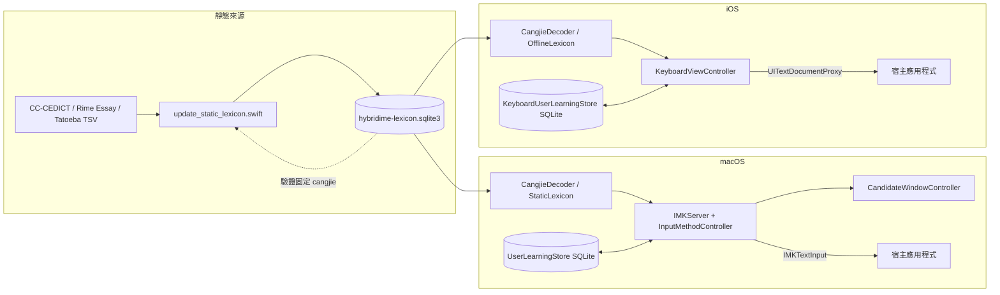

# HybridIME 技術文件

本文件描述目前工作樹中的實際原始碼、Xcode 設定與資料資產。它不以舊版發行結果、檔名推測或先前實機結果代替本次證據。

狀態用語：

- **已實作**：原始碼已存在並接入正常執行路徑。
- **已有測試涵蓋**：儲存庫有相應的測試工具，但不表示本次已執行。
- **本次工作已驗證**：本次文件工作確實執行並成功完成驗證。
- **尚未經外部驗證**：需要安裝、真實文字用戶端、模擬器／裝置、憑證或外部系統才能確認。
- **實驗性／未啟用**：存在，但目前不能作為正常保證路徑。
- **規劃中／尚未實作**：只有合理的擴充點，尚未實作。

## 1. 系統概覽

HybridIME 在一個 Xcode 專案中提供兩套平台配接器：

- macOS `HybridIME`：經典的 InputMethodKit 應用程式，`IMKInputController` 接收事件並用 `IMKTextInput` 更新宿主應用程式。
- iOS／iPadOS `HybridIMEKeyboard`：`UIInputViewController` 鍵盤延伸功能，以 `UITextDocumentProxy` 插入、刪除與移動游標；由 SwiftUI 宿主應用程式 `HybridIMEiOS` 嵌入。

兩平台各有自己的控制器、詞典包裝層、聯想邏輯與學習儲存庫，沒有獨立的共享 Swift 模組。它們使用同一份生成後的 SQLite 詞彙資產，但原始碼有重複實作。

正常執行期完全離線：

1. 以隨附的唯讀 SQLite 查詢倉頡、雙語與聯想資料。
2. 由平台控制器管理組字狀態、候選及宿主文字替換。
3. 把使用者選擇寫入建置目標容器的本機 SQLite 學習資料庫。

沒有執行期後端、HTTP 提供者、登入、APNs、iCloud、Keychain 或遙測路徑。

## 2. 架構



### 依賴方向

- 平台控制器擁有生命週期與組字狀態。
- 解碼器／詞彙／聯想／排序器不會呼叫 UI 程式碼。
- 候選 UI 使用控制器產生的呈現資料。
- 學習儲存庫負責 SQLite 結構與持久化；儲存庫無法使用時，呼叫端會收到空結果。
- 更新腳本讀取雙語／聯想來源並更新已納入儲存庫的執行期資產；執行期絕不讀取原始 CC-CEDICT 或聯想 TSV，倉頡則只讀取 SQLite canonical table。

沒有相依性注入框架。macOS `InputResources` 與 iOS 控制器屬性充當組字根。正式執行使用共用的單例學習儲存庫；接受資料庫 URL 的初始化器支援獨立測試。

## 3. 專案結構

| 路徑 | 職責 |
| --- | --- |
| `HybridIME/HybridIMEApp.swift` | macOS `NSApplication` 入口、`IMKServer`、共用資源預載入 |
| `HybridIME/InputMethodController.swift` | macOS 事件狀態機、候選、提交、標點與聯想 |
| `HybridIME/CandidateWindowController.swift` | 不啟用的 macOS 候選面板與插入點定位 |
| `HybridIME/CangjieDecoder.swift` | macOS SQLite 倉頡查詢與字形過濾器 |
| `HybridIME/StaticLexicon.swift` | macOS 唯讀 SQLite 倉頡／雙語／聯想查詢 |
| `HybridIME/BilingualDictionary.swift` | macOS 雙語詞彙查詢的領域包裝層 |
| `HybridIME/AssociationDictionary.swift` | macOS 靜態與學習聯想的合併／排序 |
| `HybridIME/SmartCandidateRanker.swift` | macOS 最近使用智慧候選選擇 |
| `HybridIME/UserLearningStore.swift` | macOS 可寫入的 SQLite 學習結構 |
| `HybridIMEKeyboard/KeyboardViewController.swift` | iOS 鍵盤 UI、文字代理操作與組字狀態 |
| `HybridIMEKeyboard/OfflineLexicon.swift` | iOS 具有限制快取的唯讀 SQLite 倉頡／雙語／聯想查詢 |
| `HybridIMEKeyboard/KeyboardAssociationDictionary.swift` | iOS 聯想合併／排序 |
| `HybridIMEKeyboard/KeyboardUserLearningStore.swift` | iOS 可寫入的 SQLite 學習結構 |
| `HybridIMEKeyboard/PunctuationStrategy.swift` | iOS 標點定義、上下文與顯示標籤 |
| `HybridIMEKeyboard/PrivacyInfo.xcprivacy` | 鍵盤延伸功能隱私權資訊清單：不追蹤／無收集資料，以及 SystemBootTime 理由 `35F9.1` |
| `HybridIMEiOS/ContentView.swift` | 宿主應用程式設定、離線本機學習與第三方鍵盤系統限制說明 |
| `HybridIME/CangjieData/` | 保留的倉頡變更記錄、授權與聲明；不含可重建資料 |
| `HybridIME/DictionaryData/` | 用於產生 SQLite 的 CC-CEDICT 來源索引、覆寫項目、授權與聲明 |
| `HybridIME/AssociationData/` | 中文／英文聯想來源索引、授權與聲明 |
| `HybridIMEKeyboard/LexiconData/` | 鍵盤延伸功能使用的隨附 SQLite 詞彙與複製的聲明 |
| `Scripts/` | 資料集建置器、驗證器、獨立測試與發行工具 |

專案使用 Xcode 檔案系統同步群組。macOS 建置目標明確排除原始詞典／聯想 TSV 資源，並明確包含 `HybridIMEKeyboard/LexiconData/hybridime-lexicon.sqlite3`；因此兩個平台建置目標都使用儲存庫中同一份生成的詞彙檔案，且不封裝可重建的資料 TSV。

## 4. 資料流程

### 靜態資料產生

`Scripts/build_cedict_index.swift`、`Scripts/build_chinese_associations.swift` 與 `Scripts/build_english_associations.swift` 產生來源 TSV 索引。`Scripts/update_static_lexicon.swift` 會：

1. 先驗證既有 SQLite 的完整性、`user_version=2`、固定表次序 `cangjie → association → bilingual`，以及 `cangjie` 的結構、33,318 筆資料、36,862 個候選與固定內容指紋。
2. 只在 transaction 中清除並重新寫入 `association(language, key, candidates)` 與 `bilingual(direction, key, candidates)`；絕不 drop、重建或修改 `cangjie`。
3. 將英文鍵值正規化為小寫，保留來源候選順序，並套用 `HybridIME/DictionaryData/dictionary-overrides.tsv` 的 `add-e`、`add-z`、`replace-e`、`replace-z` 操作。
4. 將 Rime Cangjie、CC-CEDICT、Rime Essay 與 Tatoeba 的授權／聲明更新至 `LexiconData/`。

`cangjie` 的唯一且固定來源是 `HybridIMEKeyboard/LexiconData/hybridime-lexicon.sqlite3` 內的二進位 SQLite 表；不再有可重建它的 TSV／YAML 或建置工具。`Scripts/verify_static_lexicon.swift` 唯讀開啟該資料庫，驗證固定結構和列數，並完整比對 `association`、`bilingual` 與其來源。

目前已納入儲存庫的資料庫回報 177,594 個雙語資料列與 244,887 個聯想資料列。這些數量是儲存庫快照，不是服務狀態。

### macOS 輸入流程

1. `HybridIMEApp` 建立 `IMKServer`；`InputResources` 建立 `StaticLexicon`、詞典包裝層與聯想詞典，接著在分離的工作中載入倉頡。
2. `InputMethodController.handle` 接受 `keyDown`；Command／Control／Option 與不支援的系統事件會返回宿主應用程式。
3. ASCII 字母立即插入宿主應用程式，並附加到記憶體中的緩衝區；控制器另行追蹤其 UTF-16 範圍，不使用標記文字顯示英文組字。
4. 最多五個字母會查詢倉頡；完整緩衝區也會查詢英譯中的 SQLite 項目。
5. 每個倉頡候選最多可加入兩個中譯英結果，使用前方中文加目前候選的最長尾綴。
6. 結果會去除重複、限制為十個，並可選擇依最近學習的候選重新排序。
7. `1`–`0` 只在對應候選存在時攔截按鍵，並以 `IMKTextInput` 替換已追蹤範圍；沒有對應候選的數字交回宿主。
8. `Return` 不提交候選，只清除目前組字狀態並交回宿主處理。
9. 若 Safari URL 欄在已輸入字母後選取自動完成尾段，只要選取起點仍在追蹤範圍尾端，組字便會繼續；候選替換及 Delete 會一併處理該尾段。若游標、範圍或原文不再吻合，控制器會拒絕替換並重設狀態。
10. 直接英文緩衝區在標點輸入前以原文提交，並強制使用英文的半形標點預設值；候選區中的中文不參與標點語言判斷。只有已實際提交的中文字會建立後續中文標點上下文。

在倉頡預載入完成前，原始英文仍可使用；倉頡結果為空。SQLite 包裝層會同步建立，因此可用的詞典結果不必等待分離的倉頡工作。

### iOS 鍵盤流程

iOS 無法透過目前實作的路徑使用標記文字。`enterLetter` 立即呼叫 `textDocumentProxy.insertText`，將相同字元附加到 `buffer`，再推導候選。只有當 `documentContextBeforeInput` 仍以該緩衝區結尾時，選取候選才會成功；控制器會刪除那些字元並插入替換文字。

這項「失敗即拒絕」的尾綴檢查也保護翻譯與標點替換。如果宿主應用程式不提供上下文，或文字在插入與選取之間改變，系統會拒絕替換，而不會刪除無關內容。

沒有組字時，第一次 Space 實際插入空格後會建立僅限控制器本身的「等待第二擊」狀態；這包含以 Space 提交直接英文後所附加的空格。第二次 Space 只會在 `documentContextBeforeInput` 仍以該空格結尾時刪除它並插入句點，因此不會修改游標前既有的空格，也不會留下尾隨空格。句點寬度沿用 `PunctuationStrategy` 對最近實際提交非空白字元的判定：中文為 `。`，英文或無可用上下文時為 `.`。候選選取、Shift-Space、刪除與長按 Space 游標手勢都會清除等待狀態。

Delete 按鈕的點按動作會呼叫一次 `deleteBackward()`。長按手勢在 0.35 秒後先刪除一次，再以加入主執行緒 common run-loop mode 的 `Timer` 每 0.08 秒重複呼叫相同路徑，因此每次刪除都會同步更新組字緩衝區與候選。手勢結束或取消、鍵盤版面重建，以及控制器檢視即將消失時都會停止並清除計時器。

### 聯想流程

- 中文查詢會嘗試最長的靜態尾綴與最長的學習尾綴，接著選取較長的鍵值；長度相同時優先使用靜態查詢鍵值，再合併學習候選。
- 英文查詢使用最後一個以空白分隔的小寫單字。
- 排序順序為最近選取、學習次數、靜態權重，最後是字典序。
- 中文提交序列會儲存最近上下文最多八個字元的一字元延續，並為每個上下文保留最多十個學習候選。
- 英文聯想提交會加入尾端空格；中文提交不會。

## 5. 核心元件

### macOS 生命週期與 UI

`HybridIMEApp` 以 `.accessory` 啟用策略執行 `NSApplication`，且沒有一般視窗。它從 `Info.plist` 讀取 `InputMethodConnectionName` 與套件識別碼；缺少值會觸發 `assertionFailure` 並阻止建立伺服器。

`CandidateWindowController` 使用位於 `.statusBar` 層級的無邊框 `NSPanel`，不取得鍵盤焦點，也不成為主視窗。它忽略滑鼠事件、加入所有 Spaces，並在可能時定位於插入點上方，否則放在下方或螢幕中央附近。候選寬度有限，超過十個項目不會分頁。

### macOS InputMethodKit 生命週期

此套件是經典的 InputMethodKit 應用程式，而不是文字輸入應用程式延伸功能。`LSUIElement=true` 與 `LSBackgroundOnly=false` 都是刻意設定。啟動時不會呼叫 `TISRegisterInputSource` 或自行啟用。

僅憑建置輸出無法驗證已安裝的輸入來源。對於已安裝、已選取但沒有回應的已簽署應用程式，請檢查統一日誌中是否有 `NO Endpoint` 或無法辨識的 `InputMethodConnectionName`。開發環境的復原順序如下：

```sh
/System/Library/Frameworks/CoreServices.framework/Frameworks/LaunchServices.framework/Support/lsregister \
  -f "$HOME/Library/Input Methods/HybridIME.app"
killall HybridIME
killall TextInputMenuAgent
open "$HOME/Library/Input Methods/HybridIME.app"
```

成功復原後仍需要真實文字用戶端檢查；僅有程序存在並不足夠。這些指令會變更本機執行期狀態，不屬於一般未簽署建置驗證。

### 詞彙包裝層

macOS `StaticLexicon` 以 `SQLITE_OPEN_FULLMUTEX` 唯讀開啟資料庫、啟用 `query_only`、每批最多處理 32 個鍵值，並維持 256 項 FIFO 快取。iOS `OfflineLexicon` 在主 actor 上使用唯讀 `SQLITE_OPEN_NOMUTEX` 與 128 項 FIFO 快取。

傳入 SQL 輔助程式的所有資料表與欄位名稱都是內部常數。使用者衍生的鍵值會使用繫結參數。

### 平台控制器

`InputMethodController` 是 macOS 組字與事件的負責者，並維護直接插入英文的追蹤範圍、Safari 自動完成尾段相容性及數字候選選取。`KeyboardViewController` 同時是 iOS UI 與狀態機的負責者，負責按鍵版面、候選、標點、聯想上下文、游標手勢、鍵盤切換、顏色及 Return 鍵標籤。大型 iOS 控制器是目前的耦合點。

iOS 控制器在緊湊版面只於 `needsInputModeSwitchKey` 為 `true` 時建立自訂地球鍵；按鈕以 `handleInputModeList(from:with:)` 為目標並處理所有觸控事件，讓 iOS 同時處理切換與長按顯示已啟用鍵盤清單。Face ID iPhone 已由系統在 extension 下方提供地球鍵時，該屬性為 `false`，因此不會在鍵盤內容內重複建立。寬版 iPad 仍固定建立自訂地球鍵。控制器明確設定 `hasDictationKey=false`，不宣告自訂聽寫鍵，讓 iOS／iPadOS 在允許時自行管理及顯示系統咪高峰；實際顯示仍取決於系統聽寫設定、裝置、版面及目前 App。目前鍵盤 UI 不包含表情符號目錄、搜尋預留位置或表情符號頁面。

### iOS 版面模式與替代符號

`KeyboardViewController` 在版面配置後，若裝置是 iPhone 且 window scene 的介面方向為橫向，便選取 `landscapePhone`；檢視尚未附著到 window 時，改以 `verticalSizeClass == .compact` 作暫時判斷。若裝置是 iPad、水平尺寸類別為 `regular` 且鍵盤檢視寬度至少 700 點，便選取 `wideIPad`；否則使用 `compact`。初始版面配置前，iPad 仍接受任何非 `compact` 的水平尺寸類別，接著由 `viewWillLayoutSubviews()` 依最終寬度重新協調。從同一裝置 Apple 內建倉頡截圖量得的整體可見高度為縱向 340 點、橫向 428 點；由於 iPadOS 會在第三方鍵盤自訂內容上方另加約 75 點的系統輸入輔助列，`wideIPad` 的自訂內容高度分別設為縱向 265 點與橫向 353 點。即使旋轉前後皆為 `wideIPad`，版面週期也會更新高度約束。iPhone 的 `compact` 縱向配置使用依最新同裝置、同宿主 App 截圖差值校準的 242 點，非寬版或浮動 iPad 的 `compact` 配置仍使用 260 點；`landscapePhone` 使用同一組截圖校準的 187 點。這些 iPhone 自訂內容高度連同系統管理區後，目標整體可見高度分別為縱向 335 點、橫向 207 點。所有版面均以低優先權的按鍵高度與 `.fillEqually` 列分配收納可用空間，避免固定 50 點按鍵連同候選列把鍵盤根視圖撐高。iPhone 緊湊版 Shift／Delete 在直向與橫向分別為 46／88 點寬，頁面鍵為 43／66 點寬，Return 為 93／138 點寬；高度不套用原生量度值，而是盡量填滿各列的可用高度。iPhone 橫向沿用緊湊版的 QWERTY、Shift、Delete、數字符號及底列位置，字母鍵將倉頡字根置左、英文字母置右，但保留原始字母的輸入與 Shift 行為，以及依 `needsInputModeSwitchKey` 決定的地球鍵。iPad 寬版使用以 50 點高度基準建立的固定 11.25 格列：一般字母、數字、符號、左 Shift、逗號及句號各佔一格；Delete、Return 及右 Shift 各佔 1.25 格。第二列以 0.45 格開始並在尾端補 0.55 格，使九個字母鍵與第一、三列同寬。字母列將 Delete 放在第一列、Return 放在第二列，第三列兩端放置 Shift。

候選捲動列固定為 38 點並保留在上述鍵盤總高度之內，而不是作為額外高度加入。候選區維持其高度；所有版面的按鍵堆疊與按鍵本身使用較低的垂直內容壓縮阻力，讓空間不足時由四列按鍵吸收壓縮，避免候選 placeholder 或候選按鈕的 intrinsic content size 推高根視圖。候選有無不會切換候選列的可見性，因此按鍵位置不會在開始組字時跳動。

鍵盤根視圖使用透明且非不透明的 surface，讓 iOS 宿主提供的鍵盤背景材質延伸至自訂內容區，視覺上銜接由系統管理的底部地球／咪高峰區。按鍵與游標觸控板覆蓋層仍使用自己的動態顏色。`keyboardAppearance` 明確要求 `.light` 或 `.dark` 時直接採用；`.default` 則讀取 keyboard window／window scene 的 `userInterfaceStyle`。控制器使用 iOS 17 的 `registerForTraitChanges([UITraitUserInterfaceStyle.self])` 在切換外觀時更新按鍵 configuration。Dark 以近黑背景和深灰鍵面、Light 以淺灰背景、白色字元鍵及較深控制鍵貼近原生英文鍵盤；這些公開 UIKit 色彩不是可取得的私有系統材質。系統底部區不屬於 extension，程式不能直接設定其顏色。

寬版數字模式呈現上下堆疊的主要／替代配對：`@／¥`、`#／€`、`$／£`、`&／_`、`*／^`、`(／[`、`)／]`、`'／{`、`"／}`、`%／§`、`-／|`、`+／~`、`=／…`、`/／\\`、`;／<`、`:／>`、`,／!` 與 `.／?`。單指平移只有在向下位移達到 12 點且大於水平位移時才會選取替代符號。選取期間會隱藏堆疊標籤、顯示置中的替代預覽並反白按鍵；結束手勢會提交替代符號，取消則還原一般標籤。主要按鍵 `@`、`#`、`$`、`&`、`(`、`)`、`'`、`"` 與 `/` 使用零堆疊間距與邊緣內縮；其餘配對使用 -5 點堆疊間距與 2 點邊緣內縮。寬版字母標點控制也會將 `!` 與 `?` 作為逗號與句號的向下輕掃替代符號。

## 6. 資料模型與狀態管理

重要的暫時狀態包括緩衝區文字、候選動作陣列、選取的聯想上下文、標點替換中繼資料，以及最近使用的預測。兩個控制器都將 UI 狀態限制在主 actor／平台主執行緒。

候選動作保留行為邊界：

- 倉頡提交：符合智慧學習資格。
- 原始英文提交：保留輸入的大小寫，並可能取代該代碼的學習資料。
- 詞典提交：英譯中結果，不會作為倉頡選擇進行智慧學習。
- 翻譯：中譯英結果，以及可選的前置字首替換。
- 聯想：記錄聯想選擇並繼續鏈結。

### 靜態資料庫

`hybridime-lexicon.sqlite3` 結構版本為 `2`，依序包含 `cangjie`、`association` 與 `bilingual` 表。它隨附於產品並以唯讀方式開啟，不包含任何使用者資料。

### 使用者學習資料庫

macOS 與 iOS 儲存庫各自建立：

- `smart_candidate(code, candidate, last_used)`.
- `association_selection(language, context, candidate, selection_count, last_selected)`.
- `learned_chinese(context, candidate, position)`.

它們使用 WAL、`synchronous=NORMAL`、`SQLITE_OPEN_FULLMUTEX` 與結構版本 `1`。檔案命名為 `hybridime-user-learning.sqlite3`，位於建置目標容器的使用者域 Application Support `HybridIME/` 目錄下。

沒有從舊版 `UserDefaults` 智慧／聯想鍵值遷移的機制，也沒有跨建置目標的 App Group。因此 macOS 與鍵盤的學習資料維持分離。由於靜態詞彙在程序存續期間不可變，因此沒有快取失效處理。

## 7. 重要邏輯與演算法

### 倉頡

靜態 SQLite 的 `cangjie` 表將小寫 ASCII 代碼對應到有順序的單字元候選。它是版本控制中的唯一固定 canonical source：更新工具只讀取它並拒絕變更，而不再存在可重新生成它的 TSV／YAML。既有變更歷史仍記錄在 `HybridIME/CangjieData/cangjie-change-log.tsv`。

兩個解碼器都使用 Core Text 拒絕替換字型為 `LastResort` 或沒有非零字形的候選。可用性會依字元快取。結果取決於作業系統字型，不能保證普遍支援 Unicode。

### 智慧候選排序

正規化的小寫代碼對應到帶有時間戳記的候選選擇。預測掃描最新記錄，選取仍存在於目前允許候選中的第一個值。這是以最近使用為基礎，不是機率、百分比或具上下文的語言模型。

透過 macOS `Shift + Space`，或 iOS 非小寫 Shift 狀態加 Space 選擇原始英文時，會以保持大小寫的原始字串取代該代碼的所有學習候選。

### 標點

兩個平台都從最近實際提交的非空白字元判定上下文，遇到句末標點即停止。macOS 尚未選取候選的直接英文固定使用半形標點，不會因候選區存在中文字而轉換。中文字元涵蓋常見的 CJK 統一表意文字、相容表意文字與擴充純量範圍。在中文上下文中，某些字元刻意優先維持半形；貨幣、斜線、括號與箭頭替代符號使用固定候選清單。

macOS 立即插入預設標點候選並記錄其範圍，在替換前驗證用戶端選取／範圍。iOS 同樣立即插入，並在刪除與替換前驗證前方完全相符的尾綴。

### iOS 游標移動

長按 Space 會進入觸控板覆蓋層。水平距離除以 5 點閾值後傳給 `adjustTextPosition`。垂直移動首先使用實際換行上下文與偏好的欄位；看不到邏輯換行時，會估算每行十個字元。此備援機制刻意採用近似值。

## 8. 外部依賴

| 依賴 | 用途 | 版本來源 | 必要性 |
| --- | --- | --- | --- |
| AppKit + InputMethodKit | macOS 服務、事件與候選視窗 | 平台 SDK | 僅 macOS |
| UIKit | 自訂鍵盤與文字代理 | 平台 SDK | iOS 鍵盤 |
| SwiftUI | iOS 宿主指示 | 平台 SDK | iOS 宿主 |
| Foundation | 檔案、字串、套件與生命週期輔助程式 | 平台 SDK | 所有建置目標 |
| CoreText | 字形可用性檢查 | 平台 SDK | 兩個輸入建置目標 |
| SQLite3 | 隨附的詞彙與學習儲存庫 | 系統函式庫；未鎖定套件版本 | 兩個輸入建置目標 |
| Rime Cangjie 資料 | 倉頡代碼表 | 聲明中記錄的提交版本 | 執行期資料 |
| CC-CEDICT | 雙語索引 | 聲明中記錄的日期／項目數 | 執行期資料 |
| Rime Essay | 中文聯想權重 | 聲明，無套件相依性 | 生成資料 |
| Tatoeba 英文 CC0 匯出資料 | 英文雙詞組 | 聲明，無套件相依性 | 生成資料 |

不會呼叫非官方的執行期端點。聲明中的外部 URL 僅用於識別資料集來源，不代表目前仍可用。

## 9. 設定

### 建置目標

| 建置目標 | 產品 | 套件識別碼 | 部署目標 | 版本 |
| --- | --- | --- | --- | --- |
| `HybridIME` | macOS 應用程式／輸入法 | `com.sunny.inputmethod.hybridime` | macOS 26.0 | 1.2.0（組建編號 20260821） |
| `HybridIMEiOS` | iOS／iPadOS 應用程式 | `com.sunny.inputmethod.hybridime.ios` | iOS 26.0 | 1.2.0（組建編號 20260821） |
| `HybridIMEKeyboard` | 鍵盤延伸功能 | `com.sunny.inputmethod.hybridime.ios.keyboard` | iOS 26.0 | 1.2.0（組建編號 20260821） |

所有建置目標都將 Swift 語言版本設定為 5.0。專案沒有 `.xcconfig`、`.swift-version`、`.xcode-version`、CI 矩陣或套件鎖定檔。中繼資料記錄以 Xcode 26.5／26.6 建立或升級，但這不是正式的最低 Xcode 宣告。

兩個 iOS 產品都以裝置系列 `1,2`（iPhone 與 iPad）為建置目標，並使用 iPhoneOS SDK。`HybridIMEiOS` 與 `HybridIMEKeyboard` 均明確將 `SUPPORTED_PLATFORMS` 限制為 `iphoneos iphonesimulator`，並停用 Mac Catalyst、Designed for iPhone／iPad on Mac，以及 Designed for iPhone／iPad on visionOS。

### macOS Info.plist 與權限設定

重要名稱包括 `InputMethodConnectionName=com.sunny.inputmethod.hybridime_Connection`、輸入模式 ID `com.sunny.inputmethod.hybridime.input`、`zh-Hant` 語言與美式鍵盤配置。Debug 使用包含 `get-task-allow` 的 `HybridIME/HybridIMEDebug.entitlements`；Release 沒有權限設定檔。兩種設定都停用 App Sandbox 並啟用強化執行期。

### 鍵盤 Info.plist

延伸功能端點是 `com.apple.keyboard-service`，主要類別是 `KeyboardViewController`，主要語言是 `zh-Hant`，`IsASCIICapable=true` 且 `RequestsOpenAccess=false`。

### 鍵盤隱私權資訊清單與歸屬聲明

`HybridIMEKeyboard/PrivacyInfo.xcprivacy` 宣告 `NSPrivacyTracking=false`、空的資料收集清單，以及 `NSPrivacyAccessedAPICategorySystemBootTime` 理由 `35F9.1`。這與 `KeyboardViewController` 僅使用 `ProcessInfo.systemUptime` 判斷 Shift 雙擊相符；不會傳送衍生值。採用檔案系統同步群組的 `HybridIMEKeyboard` 建置目標，會將此資訊清單與延伸功能資源一併包含。

`LexiconData/` 保留隨附 SQLite 詞彙所使用的 Rime Cangjie、CC-CEDICT、Rime Essay 與 Tatoeba 聲明／授權。

### 環境變數

執行期原始碼不會讀取環境變數。`Scripts/release.sh` 辨識 `HYBRIDIME_NOTARY_PROFILE`、`HYBRIDIME_RESUME_AFTER_APP_NOTARIZATION` 與 `HYBRIDIME_RELEASE_ROOT_OVERRIDE`；這些是僅供發行使用的控制項。公證設定檔會命名一個 Keychain 項目，不得將其記錄為秘密值。

發行腳本解析 `HybridIME` macOS scheme 的 Debug 與 Release 建置設定，除非兩者都使用版本 `1.2.0`、組建編號 `20260821`、部署目標 `26.0`，以及預期的 macOS 建置目標與套件識別碼，否則會硬停止。此預檢不會執行或證明簽署、公證、封裝釘選或發佈。

## 10. 錯誤處理與記錄

- 缺少靜態詞彙資源時會以 `NSLog` 記錄；倉頡、雙語與聯想查詢會降級為空結果，原始英文仍可使用。
- 建立或開啟學習資料庫失敗時會記錄錯誤，學習操作會變成無操作／空查詢。
- 無效的雙語／聯想來源 TSV 會令更新工具停止，不會寫入部分資料。
- 大多數 SQLite 準備、繫結與步驟執行失敗都會靜默回傳空值；沒有具型別的公開錯誤模型、重試或退避機制。
- macOS 缺少伺服器識別碼時，Debug 會觸發斷言且不建立 `IMKServer`。
- 候選替換會檢查目前宿主的範圍／尾綴，文字狀態過期時採取失敗即拒絕。
- 沒有面向使用者的錯誤橫幅、診斷畫面、日誌編修層或自動復原 UI。

記錄的錯誤包含資源名稱或本機錯誤描述；原始碼不會刻意記錄輸入文字、候選或憑證。

## 11. 安全性與隱私

- 執行期離線，沒有驗證、權杖、Keychain、TLS、WebView、雲端或分析程式碼。
- iOS 不要求開放存取，也沒有 App Group 權限；延伸功能儲存空間保留在自己的容器中。
- 靜態 SQLite 是唯讀；學習 SQLite 位於本機，但沒有應用程式層級加密。
- 鍵盤的隱私權資訊清單宣告不追蹤且不收集資料，並依 SystemBootTime 理由 `35F9.1` 使用 `systemUptime` 進行本機 Shift 雙擊時間判斷。
- 宿主應用程式說明學習資料保留在鍵盤延伸功能的本機容器、不會傳送，且刪除應用程式（及其延伸功能）後會移除。它也說明在安全欄位、電話／姓名-電話欄位，或宿主停用第三方鍵盤的欄位中，iOS 會使用系統鍵盤。
- macOS App Sandbox 是目前 InputMethodKit 建置目標設定的一部分，且已停用。強化執行期已啟用，但本文件不將此設定等同於已驗證的簽署發行版。
- SQL 查詢值使用準備好的繫結。資料集資料表／欄位選擇器是內部固定字串。
- 只有在候選上下文與替換防護所需時才讀取宿主文字；原始碼沒有上傳路徑。
- 沒有可檢視或清除學習資料的 UI，也沒有針對不同代碼／上下文的文件化保留期限。只有每個已學習中文上下文的候選數量受到限制。
- `Scripts/release.sh` 中存在發行簽署、公證、封裝釘選與 Gatekeeper 檢查；一般開發不會執行這些外部驗證，其存在也不代表發行版已完成。

## 12. 測試

Xcode 專案沒有測試建置目標。測試涵蓋由獨立腳本提供：

| 測試工具 | 涵蓋範圍 | 外部服務 |
| --- | --- | --- |
| `Scripts/test_static_lexicon.swift` | 倉頡候選順序／限制、雙語查詢、批次最長比對、中文／英文聯想測試資料 | 無 |
| `Scripts/test_user_learning_store.swift` | macOS 學習結構與讀寫行為 | 無；暫存 SQLite |
| `Scripts/test_mac_dictionary.swift` | macOS 詞彙 + 聯想整合與學習重新排序 | 無；暫存 SQLite |
| `Scripts/test_keyboard_user_learning_store.swift` | iOS 學習結構、替換與完整性 | 無；暫存 SQLite |
| `Scripts/verify_static_lexicon.swift` | 唯讀完整性、版本、表次序、固定倉頡結構／列數，以及雙語／聯想來源完全相等 | 無；以唯讀方式開啟隨附 DB |

代表性指令只使用 `/tmp` 輸出：

```sh
swiftc -parse-as-library -module-cache-path /tmp/hybridime-module-cache-verify \
  Scripts/verify_static_lexicon.swift -lsqlite3 -o /tmp/hybridime-verify-static
/tmp/hybridime-verify-static

swiftc -module-cache-path /tmp/hybridime-module-cache-static \
  HybridIME/StaticLexicon.swift Scripts/test_static_lexicon.swift \
  -lsqlite3 -o /tmp/hybridime-test-static
/tmp/hybridime-test-static HybridIMEKeyboard/LexiconData/hybridime-lexicon.sqlite3

swiftc -module-cache-path /tmp/hybridime-module-cache-learning \
  HybridIME/UserLearningStore.swift Scripts/test_user_learning_store.swift \
  -lsqlite3 -o /tmp/hybridime-test-learning
/tmp/hybridime-test-learning

swiftc \
  -module-cache-path /tmp/hybridime-module-cache-mac \
  HybridIME/StaticLexicon.swift \
  HybridIME/UserLearningStore.swift \
  HybridIME/BilingualDictionary.swift \
  HybridIME/AssociationDictionary.swift \
  Scripts/test_mac_dictionary.swift \
  -lsqlite3 -o /tmp/hybridime-test-mac-dictionary
/tmp/hybridime-test-mac-dictionary \
  HybridIMEKeyboard/LexiconData/hybridime-lexicon.sqlite3

swiftc -module-cache-path /tmp/hybridime-module-cache-keyboard \
  HybridIMEKeyboard/KeyboardUserLearningStore.swift \
  Scripts/test_keyboard_user_learning_store.swift \
  -lsqlite3 -o /tmp/hybridime-test-keyboard-learning
/tmp/hybridime-test-keyboard-learning
```

### 本次工作已驗證

本次 schema 2 倉頡遷移已完成以下驗證：

- `verify_static_lexicon.swift` 通過 `integrity_check`、`user_version=2`、`cangjie → association → bilingual` 表次序、固定 33,318 筆倉頡結構，以及雙語／聯想來源完全相等檢查；資料列分別為 33,318、244,887 及 177,594。
- 四個獨立 Swift 測試工具全部通過；靜態詞彙測試涵蓋倉頡大小寫正規化、候選順序與限制。
- 未簽署 macOS Debug 及通用 iOS Simulator Debug 建置通過。兩個建置產品內的 SQLite 均回報 `integrity_check=ok`、schema 2、預期三表次序及 33,319 筆倉頡資料，並且不含 `hybrid-cangjie5.dict.tsv`。
- universal macOS Debug 版本 1.2.0（組建編號 20260821）另以 `Developer ID Application: Yan Yin Yu (WX793X49GJ)` 簽署並安裝至 `~/Library/Input Methods/HybridIME.app`；安裝後 `codesign --verify --deep --strict` 通過，隨附 SQLite 與儲存庫版本的 SHA-256 相同，且回報 33,318 筆倉頡代碼與 36,862 個候選。
- 已安裝 App 重新註冊 LaunchServices、重啟 `TextInputMenuAgent` 並成功啟動 HybridIME 程序；最近的 InputMethodKit 日誌未出現錯誤或 `NO Endpoint`。這只驗證本機註冊與程序啟動，不代表真實文字輸入、候選呈現或提交行為已通過。
- `git diff --check` 通過。

以下另保留遷移前文件工作的歷史驗證背景：

- `xcodebuild -list` 找到全部三個建置目標與 scheme。沙盒執行也回報 CoreSimulator 服務不可用；仍完成 scheme 探索。
- 歷史 SQLite 唯讀檢查回傳 `integrity_check=ok`、`user_version=1`、177,594 個雙語資料列與 244,887 個聯想資料列；這是在倉頡遷移前的結果。
- 遷移前的驗證工具曾通過雙語與聯想來源相等性檢查；目前以 Swift 唯讀驗證器取代。
- 四個獨立測試工具全部通過：`StaticLexicon`、`UserLearningStore`、macOS 詞典整合與 `KeyboardUserLearningStore`。它們的二進位檔與暫存資料庫建立於 `/tmp`；受限制的環境要求將編譯器模組快取重新導向 `/tmp`。
- 未簽署的 macOS Debug 建置曾通過 arm64 與 x86_64；這是 schema 1 的歷史建置證據。
- 未簽署的通用 iOS 模擬器 Debug 建置曾通過 `HybridIMEiOS` 及其 `HybridIMEKeyboard` 相依項目；這是 schema 1 的歷史建置證據。
- 文件編輯後，`git diff --check`、plist／權限設定靜態檢查與 Markdown 程式碼圍欄檢查通過。

在 HEAD `56fcaa7` 的 2026-08-22 文件更新中，未簽署的通用 iOS 模擬器 Debug 建置再次通過 `HybridIMEiOS` 與 `HybridIMEKeyboard`，並編譯 arm64 與 x86_64 切片。這僅是編譯與套件驗證；未執行模擬器鍵盤啟用或手勢互動。

後續在 iOS 26 Simulator 與實體 iPhone 進行有限鍵盤切換診斷：宿主會在轉場期間以 required 高度約束暫時把 extension 根視圖由最終 260 點配置為較高 frame；最小空白鍵盤亦能重現，故不能歸因於 SQLite、解碼器或完整按鍵樹。公開 API 只能以 primary view 的 Auto Layout 約束要求最終高度，不能控制宿主的中途 frame。透明根視圖在 Simulator 的視覺檢查中可與系統底部材質銜接；這不代表跨裝置、外觀與宿主均已驗證。

### 外部未驗證

- macOS 真實文字用戶端的按鍵輸入、候選呈現與提交。
- 第三方 macOS 用戶端間的候選定位與替換。
- iOS 鍵盤的完整跨裝置、方向、外觀、記憶體使用量與宿主相容性矩陣。
- Developer ID 發行簽署、封存、公證、DMG、GitHub 發行或 App Store 行為；本機 Apple Development 簽署不涵蓋這些範圍。

## 13. 已知限制與技術債

- 驗證必須繫結至受測的確切檢出內容與建置輸入；先前的建置結果不能證明後續檢出內容的行為。
- 沒有將舊 `UserDefaults` 學習資料遷移至結構版本 1 SQLite 的機制。
- macOS 與 iOS 各自重複解碼器、詞典、聯想、排序與標點概念，而非匯入共享核心。
- `HybridIME/InputMethodController.swift`，尤其是 `HybridIMEKeyboard/KeyboardViewController.swift`，集中許多狀態機與 UI 職責。
- 靜態詞彙快取淘汰是 FIFO 而非 LRU，也沒有記憶體壓力回應。
- macOS 資源預載入沒有就緒狀態、進度 UI 或重試。
- iOS 替換依賴宿主上下文與立即插入／刪除行為，而非標記文字組字。
- iOS 緊湊版面依 `needsInputModeSwitchKey` 決定是否建立地球鍵，並將自訂按鈕的切換／長按選取交給 `handleInputModeList(from:with:)`；寬版 iPad 仍固定建立自訂地球鍵，不同寬度、方向與已啟用鍵盤組合下的實際顯示仍需持續驗證。
- iPad 在 700 點邊界的寬版版面切換、11.25 格原生式幾何、Light／Dark 外觀、堆疊符號標籤，以及 12 點替代符號輕掃預覽／提交互動，在模擬器與裝置上的視覺及行為仍未驗證。
- iOS Delete 長按的 0.35 秒啟動門檻與 0.08 秒重複間隔尚未經實機驗證，仍需確認連續刪除速度與放開停止的手感。
- iOS 垂直游標備援會估算每行十個字元，無法得知視覺換行。
- 沒有可清除學習資料的設定 UI；記錄數量沒有全域上限或修剪政策。
- SQLite 執行錯誤大多靜默處理，除初始結構建立外沒有遷移。
- 沒有設定 XCTest、UI 測試、CI、靜態檢查、格式化工具、效能測試或延伸功能記憶體預算測試。
- 當解析後 macOS `HybridIME` scheme 的 Debug 或 Release 設定偏離版本 `1.2.0`、組建編號 `20260821`、部署目標 `26.0`、預期建置目標或套件識別碼時，`Scripts/release.sh` 會硬停止。
- 專案簽署包含特定擁有者的開發團隊；在其他開發者選取自己的團隊前，檢出內容的可攜性會降低。
- 儲存庫沒有全專案的原始碼授權。

## 14. 設計決策

- **離線優先：**隨附資料與本機學習避免網路依賴，讓 iOS 鍵盤不需完整存取權也能運作。
- **大型索引使用 SQLite：**倉頡、雙語與聯想資料內容維持精簡、可查詢，並由小型快取限制大小，避免急切載入 TSV 至物件。
- **固定倉頡 canonical table：**有順序的倉頡資料只保存在版本控制的 SQLite `cangjie` 表；更新工具拒絕修改它，避免意外重排或重建候選。
- **失敗即拒絕的文字替換：**範圍／尾綴防護寧可拒絕替換，也不在狀態過期後刪除宿主內容。
- **平台配接器分離：**InputMethodKit 與 `UITextDocumentProxy` 具有不同的生命週期與文字編輯契約；目前的重複實作讓差異保持明確，但增加維護成本。
- **以最近使用為基礎的學習：**可預測的最近選擇行為比不透明的統計模型簡單，但不使用周遭語言上下文。
- **啟動時不自動註冊 macOS：**安裝與文字輸入註冊保持外部處理，因此每次啟動都不會嘗試啟用輸入來源。
- **發行預檢在偏移時停止：**版本、識別碼、資源、簽章與公證檢查設計為在發佈不一致成品前先失敗。

## 15. 未來開發

以下是根據目前延伸功能端點推導出的 **計畫中／尚未實作** 建議，不是已承諾的路線圖：

- 將與平台無關的解碼、詞彙、聯想、排序與標點政策抽取至共享 Swift 模組，同時保留分離的 IMK 與鍵盤配接器。
- 在變更 `PRAGMA user_version` 前，加入從舊版 `UserDefaults` 與未來 SQLite 版本的明確結構遷移。
- 將 `KeyboardViewController` 拆分為組字、持久化、候選呈現與按鍵版面元件。
- 圍繞目前的獨立案例加入 XCTest 建置目標與測試資料包，另加入 iOS 延伸功能記憶體／啟動與宿主上下文測試。
- 加入清除學習資料的使用者控制項，以及有上限的保留／修剪政策。
- 在不記錄輸入文字的前提下，公開資源就緒狀態與診斷狀態。
- 實際發行前保留預檢、簽章、公證、資源與公開成品驗證邊界，並為每項外部狀態變更取得個別核准。

任何重構都必須保留離線運作、參數化 SQLite 值、平台容器分離、失敗即拒絕的宿主替換與第三方歸屬檔案。

## 授權與歸屬聲明

找不到全專案 `LICENSE`，因此本文件不對原始碼再散布權作任何聲明。

隨附資料集各自保留獨立條款：

- Rime Cangjie：請參閱 `HybridIME/CangjieData/LICENSE-Rime-Cangjie.txt` 與 `HybridIME/CangjieData/NOTICE.txt`；隨附 SQLite 的副本位於 `HybridIMEKeyboard/LexiconData/`。
- CC-CEDICT：請參閱 `HybridIME/DictionaryData/LICENSE-CC-CEDICT.txt` 與 `HybridIME/DictionaryData/NOTICE-CC-CEDICT.txt`。
- Rime Essay 與 Tatoeba：請參閱 `HybridIME/AssociationData/` 中的聲明與授權。
- iOS 隨附詞彙在 `HybridIMEKeyboard/LexiconData/` 下包含對應副本。
